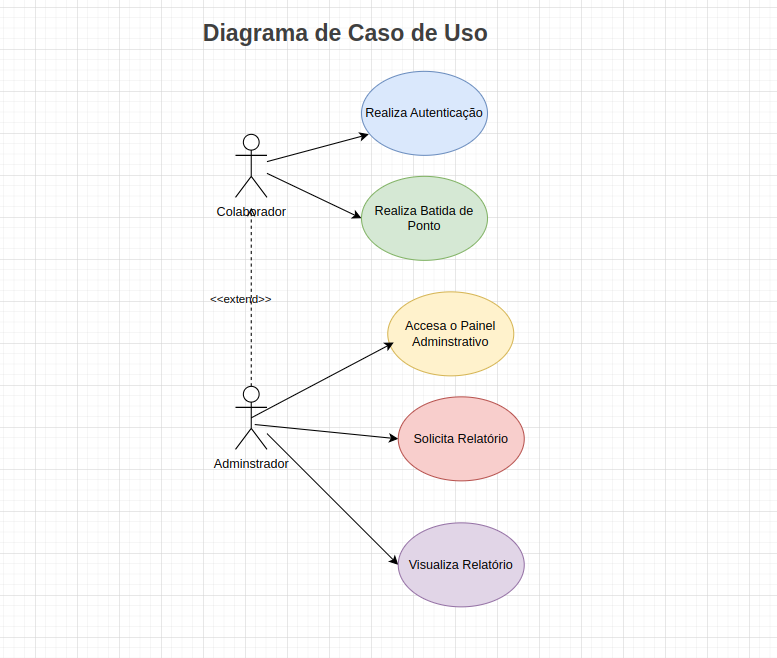
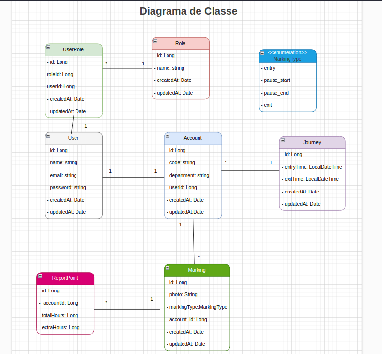

# 🧪 ChronoTrack

## 🧱 1. Descrição do Projeto

ChronoTrack é um estudo de caso com o objetivo de desenvolver uma aplicação completa, cobrindo todas as etapas do ciclo de desenvolvimento — da análise de requisitos à implantação em nuvem.

O projeto busca simplificar a rotina de colaboradores que precisam registrar seus pontos de entrada e saída. Para isso, contará com um aplicativo móvel, onde o colaborador poderá realizar suas marcações de ponto, que serão enviadas para o sistema backend.

Do outro lado, o administrador poderá visualizar os registros realizados por sua equipe por meio de uma interface administrativa.

Escolhi esse projeto com base em um caso real em que atuei profissionalmente, mas agora com liberdade para explorar melhorias de automação e aplicar decisões arquiteturais que visem escalabilidade, manutenibilidade e boas práticas de engenharia.

---

## 🎯 2. Objetivos

- Aprimorar minhas habilidades como analista e arquiteto, avaliando trade-offs e justificando decisões técnicas frente aos principais desafios encontrados.
- Aplicar boas práticas de desenvolvimento e metodologias ágeis na construção de uma solução consistente, testável, escalável e de fácil manutenção.
- Projetar e implementar uma solução completa na nuvem, com foco em automação, segurança e manutenibilidade.

---

## 🚀 3. Funcionalidades

- **Registro de ponto de entrada e saída**  
  O colaborador poderá registrar horários de início, término e pausas da jornada pelo app móvel. As marcações são sincronizadas com o backend.

- **Cálculo automático de horas trabalhadas**  
  O sistema calcula automaticamente as horas diárias, considerando pausas e horas extras.

- **Geração de relatórios por período**  
  O administrador poderá gerar relatórios filtrando por colaborador, data ou equipe, facilitando a análise de produtividade.

- **Autenticação e controle de acesso por perfil**  
  Segurança implementada com autenticação JWT, garantindo o acesso apenas às funcionalidades permitidas por perfil.

- **Painel administrativo para gestão de colaboradores e registros**  
  Dashboard para administradores gerenciarem usuários, definirem jornadas padrão e acompanharem os registros em tempo real, com opção de exportação.

---

## 🏗️ 4. Arquitetura e Tecnologias

### 🔧 Backend
- **Spring Boot** – Inicialização rápida e foco na regra de negócio.
- **JPA (Hibernate)** – ORM para mapeamento objeto-relacional.
- **Flyway** – Controle de versionamento e migração do banco de dados.
- **PostgreSQL** – Banco de dados relacional robusto.
- **RabbitMQ** – Comunicação assíncrona para emissão de relatórios.
- **Docker** – Containerização e empacotamento da aplicação.
- **JUnit / Mockito** – Testes de unidade e integração.

### 💻 Frontend
- **Angular** – [em desenvolvimento].

### 📱 Mobile
- **Flutter** – [em desenvolvimento].

---

## ☁️ 5. Deploy / DevOps

- **Docker Compose** – Orquestração local dos serviços da aplicação (API, banco, fila, etc.).
- **GitHub Actions** – CI/CD automatizado para testes, builds e deploys.
- **Implantação em nuvem** – Inicialmente em VPS (Hostinger); migração futura para AWS planejada.

---

## 📌 Status do Projeto

| Módulo        | Status        |
|---------------|----------------|
| Backend       | ✅ Em desenvolvimento ativo |
| Frontend      | ⏳ Ainda não iniciado |
| Mobile        | ⏳ Ainda não iniciado |
| CI/CD         | ✅ Configurado com GitHub Actions |
| Infraestrutura| ✅ Dockerizada localmente |

---

## 🧰 Diagramas

### 📌 Diagrama de Caso de Uso

O diagrama de caso de uso apresenta os dois atores principais:
- **Colaborador**, que realiza marcações de ponto.
- **Administrador**, que estende o papel do colaborador e tem acesso a funcionalidades administrativas, como visualização de relatórios e gestão de usuários.

---

### 📌 Diagrama de Classes

O diagrama de classes define a estrutura de entidades do sistema, destacando:
- Usuários, perfis e permissões (User, Role, UserRole).
- Entidades responsáveis pelas marcações de ponto (Marking), jornada (Journey), e contas (Account).
- Relacionamentos entre as entidades e atributos principais para persistência e controle de dados.

---

## 📄 Licença

Este projeto é um estudo de caso e não possui licença de uso comercial no momento.

---

## 🙋‍♂️ Autor

Desenvolvido por [Lucas Santos](https://github.com/Luke0195).  
Se tiver interesse em discutir melhorias, sugestões ou oportunidades, sinta-se à vontade para entrar em contato!
